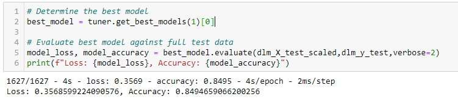

# Final_Project_Group4

# Diabetes Analysis

## Overview
### Topic: Diabetes  
Diabetes is a chronic disease that occurs when the pancreas doesn’t produce enough insulin or the body can’t use it as well as it should. Our bodies break down the food we eat into glucose and gets released into the bloodstream. When blood glucose levels go up, insulin should let the glucose into the body’s cells to be used for energy. When insulin is low, too much glucose stays in the bloodstream and can cause life threatening complications. Diabetes can be caused by genetics or lifestyle factors like eating and exercise habits. Over time, diabetes can lead to other serious problems like kidney disease, heart disease or vision loss.  

There are over 37 million adults in the US living with diabetes and many more that go undiagnosed. We chose this topic to help predict the probability of a person having diabetes using supervised machine learning models.

Note: Reasoning for topic selection is documented in the project proposal and project status is documented in the project proposal and the checklist section. 

## Data source: 

The dataset used for our research was the diabetes_binary_health_indicators_BRFSS2015.csv, extracted from the data pool of health-related telephone survey of 2015 provided by the Behavioral Risk Factor Surveillance System (BEFSS). The data file contains 253,680 survey responses to the CDC's BRFSS2015. The target variable Diabetes_binary has 2 classes. 0 is for no diabetes, and 1 is for prediabetes or diabetes. This dataset has 21 feature variables and is not balanced. The original post can be found on Kaggle; please access the following link to the original post.

[link to the original post](https://www.kaggle.com/datasets/alexteboul/diabetes-health-indicators-dataset)

## Questions 
After testing the maching learning models, which model has the highest accuracy? 

What is the correlation between the vector and the target variable? 

## Checklist

   * __AWS Database - Completed__
    

   * __S3 Bucket - Completed__
    

   * __Tables Created in Database - Completed__
    

   
## Webpage
   
   * __A Flask app with Deep Machine Learning has been completed and deployed to an URL using Heroku.__
   
   [link to the Flask app](https://diabetes-model.herokuapp.com/)
   
       

## Tableau Analysis

Total Number of Patients

Diabetic to Non-Diabetic Patients

Gender of All Patients 

Gender of Diabetic Patients 

Age of Diabetic Patients by Gender

Smokers & Alcohol Consumption

Physical Activity by Education

Fruit & Vegetable Consumption by Income

Average BMI by Gender 

Average BMI by Age 

Diabetes Analysis Dashboard

[Link to Tableau Story](https://public.tableau.com/views/Diabetes_Analysis_16786693958130/DiabetesAnalysisStory?:language=en-US&publish=yes&:display_count=n&:origin=viz_share_link)

## Results 

## Summary 
