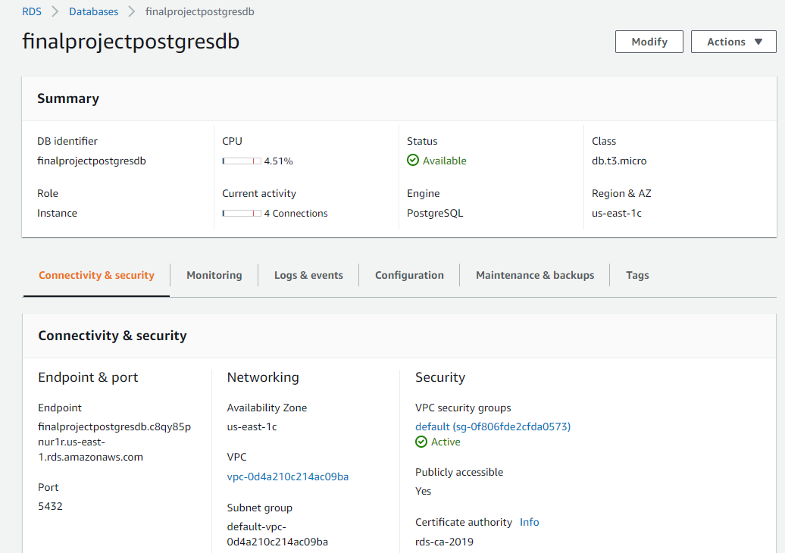
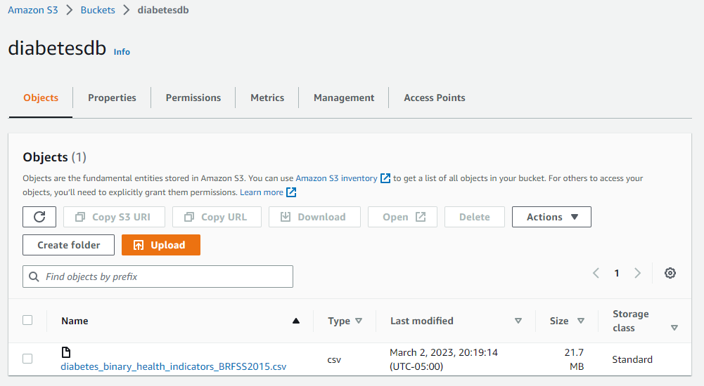
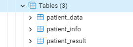

# Final_Project_Group4

# Diabetes Analysis

## Overview
### Topic: Diabetes  
Diabetes is a chronic disease that occurs when the pancreas doesn’t produce enough insulin or the body can’t use it as well as it should. Our bodies break down the food we eat into glucose and gets released into the bloodstream. When blood glucose levels go up, insulin should let the glucose into the body’s cells to be used for energy. When insulin is low, too much glucose stays in the bloodstream and can cause life threatening complications. Diabetes can be caused by genetics or lifestyle factors like eating and exercise habits. Over time, diabetes can lead to other serious problems like kidney disease, heart disease or vision loss.  

There are over 37 million adults in the US living with diabetes and many more that go undiagnosed. We chose this topic to help predict the probability of a person having diabetes using supervised machine learning models.

Note: Reasoning for topic selection is documented in the project proposal and project status is documented in the project proposal and the checklist section. 

## Data source: 

The dataset used for our research was the diabetes_binary_health_indicators_BRFSS2015.csv, extracted from the data pool of health-related telephone survey of 2015 provided by the Behavioral Risk Factor Surveillance System (BEFSS). The data file contains 253,680 survey responses to the CDC's BRFSS2015. The target variable Diabetes_binary has 2 classes. 0 is for no diabetes, and 1 is for prediabetes or diabetes. This dataset has 21 feature variables and is not balanced. The original post can be found on Kaggle; please access the following link to the original post.

[link to the original post](https://www.kaggle.com/datasets/alexteboul/diabetes-health-indicators-dataset)

## Questions 
After testing the maching learning models, which model has the highest accuracy? 

What is the correlation between the vector and the target variable? 

## Database and Tables

   * __AWS Database__
    

   * __S3 Bucket__
    

   * __Tables Created in Database__
   
   
## Languages, Tools and Algorithms

   * __Languages:__ Python, HTML

   * __Tools:__ pandas, numpy, scikit-learn, imblearn, sqlalchemy, getpass, collections, tensorflow, os, keras_tuner, keras, pickle, flask, AWS, Heroku 

   * __Algorithms:__ Support Vector Machine, Decision Trees, RandomOverSampler, SMOTE, ClusterCentroids, SMOTEENN, BalancedRandomForestClassifier, EasyEnsembleClassifier, Neural Network Model.

## Tableau Analysis

There are 229,474 patients in this dataset. 

194,377 Patients are non Diabetic & 35,097 patients are Diabetic.

Gender of All Patients 
128,715 Patients are female & 100,759 are male. 

Gender of Diabetic Patients 
Of the Diabetic patients, 18,345 are female & 16,752 are male.

Age of Diabetic Patients by Gender
Male and female diabetic patients follow the same age pattern. The amount of diabetic patients jumps up around ages 40-45 and peeks at ages 65-69 for males and females.  

Diabetic Patients - Smokers and Alcohol Consumption
Among diabetic patients, there are more smokers. The smokers consumed almost three times more alcohol in the last 30 days than non smokers. 

Non Diabetic Patients - Smokers and Alcohol Consumption
Among non diabetic patients, there are less smokers. The smokers consumed almost two times more alcohol in the last 30 days than non smokers. 

Income 

Physical Activity 

Fruit & Vegetable Consumption

Average BMI by Gender 

Average BMI by Age 
BMI - Body Mass Index is a weight-to-height ration used to indicate if a person is over or underweight. To get the BMI, you divide your weight in kilograms by the square of height in meters. BMI = kg/m2
Overall, diabetic patients have a higher BMI then non diabetic patients. 
Among diabetic and non diabetic patients, ages 18-24 & 70-80+ had the lowest BMI and ages 40-49 had the highest BMI. 
Diabetic Patients
The 18-24 & 60-80+ age ranges have a BMI of 28.073-32.667. The 25-59 age range have a BMI of 33.347-35.065. 
Non Diabetic Patients 
The 18-29 & 70-80+ age ranges have a BMI of 25.765-27.704. The 30-69 age range have a BMI of 28.082-29.026. 

[Link to Tableau Story](https://public.tableau.com/views/Diabetes_Analysis_16786693958130/DiabetesAnalysisStory?:language=en-US&publish=yes&:display_count=n&:origin=viz_share_link)

## Results 

Multiple supervised machine learning models and deep machine learning models have been tested. The performance of each model is shown below:

   * __SVM Model__
    
   
   * __Decision Tree Model__
    
   
   * __RandomOverSampler Model__
   
   
   * __SMOTE Model__
   
   
   * __ClusterCentroids Model__
   
   
   * __SMOTEENN Model__
   
   
   * __BalancedRandomForestClassifier Model__
   
   
   * __EasyEnsembleClassfiler Model__
   
   
   * __Deep Learning Model__
   
   
  
   * __Neural Network Model(Keras-Tuner)__
   
   
   
## Summary 

Based on the results, the neural network model discovered using automated hyperparameter tuning outperforms the other machine learning models.

## Webpage
   
   * __A Flask app with Neural Network Model has been deployed to an URL using Heroku.__
   
   [link to the Flask app](https://diabetes-model.herokuapp.com/)
   
    
